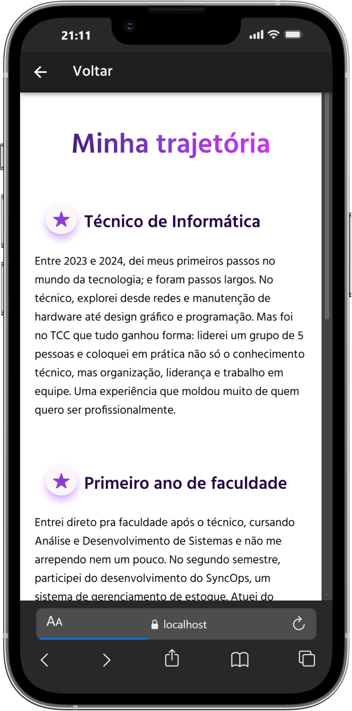

<div align="center">
<h1>📱 meu-portfolio-ionic</h1>

> Meu primeiro projeto com Ionic + Angular. uma apresentação pessoal em formato de app mobile.
</div>


## 🙋‍♀️ Sobre o projeto

Este app foi desenvolvido como **avaliação formativa** da faculdade, no curso de **Análise e Desenvolvimento de Sistemas**. A proposta era criar uma apresentação pessoal simples em formato mobile, e eu aproveitei a oportunidade para ir além do básico: explorei componentização, navegação entre telas, ícones dinâmicos e estilização com SCSS.

É o meu primeiro contato real com **Ionic** e **Angular**, e foi uma experiência que me ensinou muito mais do que eu esperava.


## 📸 Telas

<div align="center">
     
     
</div>


## ✨ Funcionalidades

- Tela de apresentação pessoal (Home)
- Tela de trajetória profissional (Sobre)
- Navegação entre telas com roteamento lazy loading
- Links diretos para LinkedIn e GitHub
- Layout responsivo adaptado para mobile


## 🛠️ Tecnologias utilizadas

- [Ionic Framework](https://ionicframework.com/)
- [Angular](https://angular.io/) (Standalone Components)
- TypeScript
- SCSS
- Ionicons


## 🚀 Como rodar o projeto

```bash
# Clone o repositório
git clone https://github.com/Paamzzz/meu-portfolio-ionic.git

# Acesse a pasta
cd meu-portfolio-ionic

# Instale as dependências
npm install

# Rode no navegador
ionic serve
```

---

## 📁 Estrutura de pastas

```
src/
└── app/
    ├── pages/
    │   ├── home/
    │   └── sobre/
    ├── app-routing.module.ts
    └── app.module.ts
```

---

## 👩‍💻 Autora

**Pamela Amancio Goulart**  
Estudante de Análise e Desenvolvimento de Sistemas — Turma ADS0301M  

[](https://linkedin.com/in/pamela-amancio-goulart)
[](https://github.com/Paamzzz)
